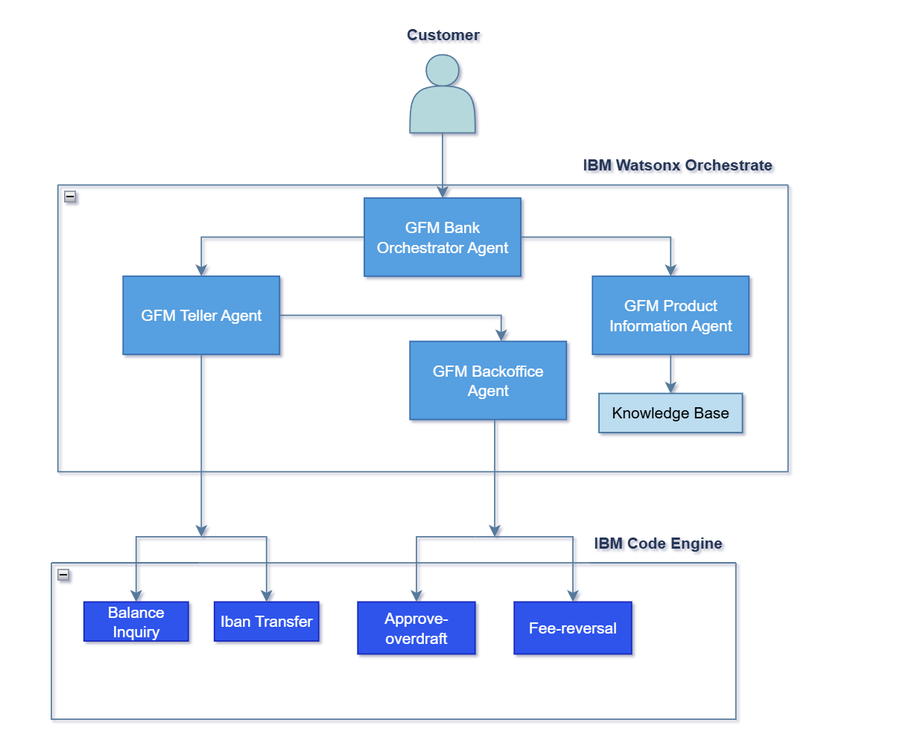

# 🏦 Banking Automation with Agentic AI

## 🤔 The Problem
GFM Bank is facing significant operational challenges due to its reliance on traditional, manual banking processes. Customers often endure long wait times—20 to 30 minutes to speak with a teller, and up to 45 minutes more for back-office approvals. These delays are especially problematic during peak seasons and for complex requests, such as overdraft approvals or fee reversals. Additionally, services are only available during business hours, limiting accessibility and convenience. Staff are burdened with repetitive tasks, leading to inefficiencies and inconsistent customer experiences.

---

## 🎯 Objective
The **GFM Bank Agentic AI System**, powered by **Watson Orchestrate**, aims to modernize banking operations by deploying a network of intelligent, collaborative AI agents. These agents automate routine tasks, streamline complex workflows, and provide customers with fast, reliable, and 24/7 service—all while ensuring compliance with banking regulations.

### 💡 Key Capabilities

* **Frictionless Customer Interactions**
  
  * 24/7 AI-powered support for balance inquiries, transfers, overdraft requests, and more.
  * Seamless conversational interface that guides users through complex banking tasks.
    
* **Intelligent Automation & Decisioning**

  * Automated validation of transactions and overdraft requests based on account history and policy rules.
  * Smart routing of requests to the appropriate AI agent (e.g., Teller, Backoffice, Product Info).

* **Enhanced Transparency & Support**
  
  * Instant, accurate responses to customer queries using a RAG-enabled knowledge base.
  * Clear, guided workflows that reduce confusion and improve customer confidence.

---

## 📈 Business Value

### For Customers
* Access to banking services anytime, anywhere
* Rapid processing of transactions and approvals
* Reduced need to visit physical branches
* Personalized, conversational banking experience
* Faster resolution of issues like overdrafts and fee reversals

### For Bank Staff & Operations
* Significant reduction in manual workload
* More time for staff to focus on high-value, complex customer needs
* Automated compliance checks and decision-making
* Improved operational efficiency and customer satisfaction
* Scalable solution that adapts to seasonal demand and customer volume
---

## 🏛 Architecture

---

## 📝 Hands-on step-by-step lab

Please find the step-by-step instructions [Hands-on Lab](/assets/hands_on_lab_banking_automation.md) on how you can implement this use case.
